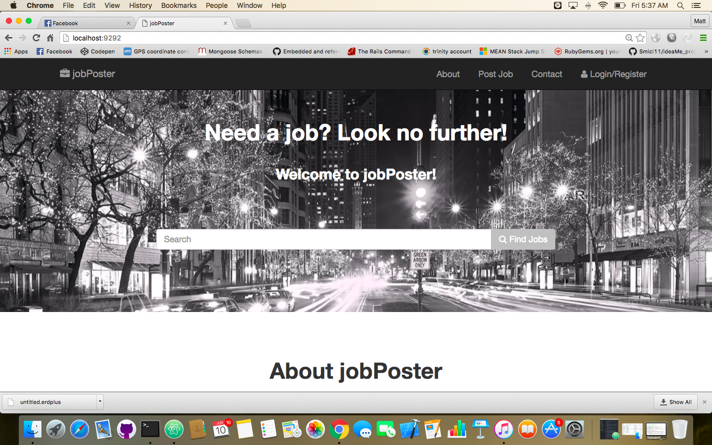

#jobPoster

###By Matt Sullivan

[Project Site](https://obscure-mesa-15886.herokuapp.com/)

[User Story](https://trello.com/b/44STJ8Vi/jobs)

Welcome to jobPoster! The last job hunting site you'll ever have to visit.
Technologies:

##Technologies

*Sinatra
*Ruby
*PostgresSQL database
*Bootstrap

##Setup

*clone or download this repo
*Run 'bundle install'
*Run 'rerun 'rackup''
*Type 'localhost:9292' in the browser url bar
*Happy job hunting!

##Planned Features

Users are able to Navigate the site with ease via NavBar and Search Bar. View, Update, Edit, and Delete Job Posts.

##Bugs/Features

The search function is currently commented out because I am still debugging it.

##Wishlist features

*Would love to create a User database with user authentication, messaging, comments, and likes.

*Also would love to set up an AJAX call to github/jobs/api to seed my jobs database. If all these "wishes" were to be accomplished then I'd feel that this project would be close to complete.

##Shout out

*to Jen thanks for helping me out with search funk.

*to Josh from GA Sydney for the styling tutorial.

*to each of my classmates. Your positive attitudes each day and ridiculously creative minds keep me going. :)

Status API Training Shop Blog About
